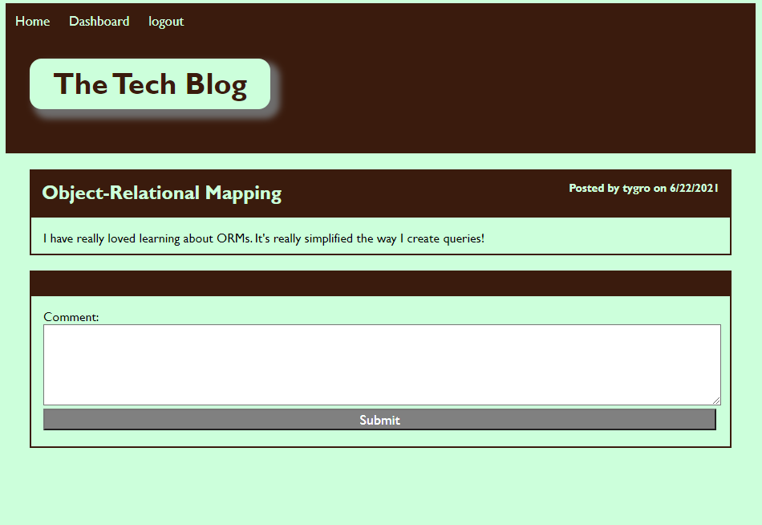

 

# Unit 14: Tech Blog

## [Description](#description)

In this homework, I created a Tech Blog application that allows the user to publish blog posts and to comment on other user's posts as well. This application follows the MVC paradigm in its architectural structure, using Handlebars.js as the templating language, sequelize as the ORM, and the express-session npm package for authentication. 

The Homepage of the website displays all the posts saved on the dataBase. At the top, the website displays three links, home, dashboard, and login. When the user clicks login at the top of the page, a new window will display and will allow the user to log in or to create a new user account. When the user clicks on Dashboard, the page will display all the posts the user has created. When the user clicks a post on the dashboard, the application displays the post and it will allow the user to update the post or to delete the post. At the dashboard, the user has the option to create a new post. When the user clicks on the Home link, the user will be taken to the homepage. When the user clicks on a post, the user wil be allowed to leave a comment.  

### Link to application:
Here is a screencapture video demostrating the functionality of the [application](https://watch.screencastify.com/v/2tSgSURA3KFGoKEbN40Z). If this link does not work, you can try [this one](https://drive.google.com/file/d/1uLZd1KqC8DDoiwGroYF1s51Z6KlsV6V1/view).

To deploy the application, I am using Heroku. Here is the Link to the deployment of the [application](https://tech-blog-mm-14.herokuapp.com/) and this is the link to the [repository](https://github.com/MaryMD98/Tech-Blog.git).

## Table of Content

* [Description](#description)
* [Installation](#installation)
* [Test](#test)
* [Usage](#usage)
* [License](#license)
* [Contributing](#contributing)
* [Questions](#questions)

## [Installation](#installation)
To initialie, run the following command.

    click on the application link on the link to application at the description section. 

## [Test](#test)
To run tests, run the following command

    no tests at this moment

## [Usage](#usage)

This application allows a user to create posts and to comment on other user's posts as well.

### Screenshot of Tech Blog application:

## [License](#license)

## [Contributing](#contributing)

none

## [Questions](#questions)

If you have any questions about the repo, or would like to contact me directly, 
here is my email: maribel.montes4@gmail.com. You can find more of my work at [Maribel Montes](https://github.com/MaryMD98).

